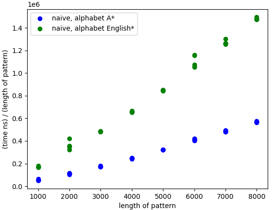
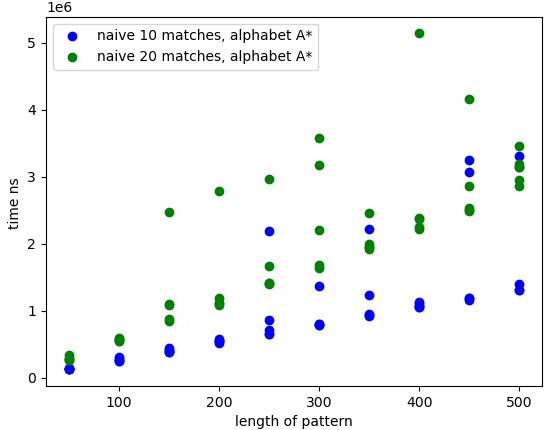

[](https://classroom.github.com/online_ide?assignment_repo_id=8749050&assignment_repo_type=AssignmentRepo)
# Project 2: Suffix tree construction

You should implement a suffix tree construction algorithm. You can choose to implement the naive O(n²)-time construction algorithm as discussed in class or McCreight’s O(n) construction algorithm. After that, implement a search algorithm (similar to slow-scan) for finding all occurrences of a pattern. This algorithm should run in O(m+z) where m is the length of the pattern and z the number of occurrences.

Write a program, `st` using the suffix tree exact pattern search algorithm (similar to slow-scan) to report all indices in a string where a given pattern occurs. 

The program should take the same options as in project 1: `st genome.fa reads.fq`. The program should output (almost) the same SAM file. Because a search in a suffix tree is not done from the start to the end of the string the output might be in a different order, but if you sort the output from the previous project and for this program, they should be identical.

The code is set up to build the tool `st` once you provide the details, and then you can install it at the root with

```bash
> GOBIN=$PWD go install ./...
```

## Evaluation

Implement the tool `st` that does exact pattern matching using a suffix tree. Test it to the best of your abilities, and then fill out the report below.

# Report

## Specify if you have used a linear time or quadratic time algorithm.

We did not implement McCreight's Algorithm. We only had time to implement the quadratic time algorithm.


## Insights you may have had while implementing and comparing the algorithms.

We saw that the Search function could be implemented in a way where it could be used both for building the suffix tree and for searching for patterns later on.

It was also interesting to to implement our own data structure and see how this structure did computations notably slower than the algorithms in the previous assignment (Even when having the same time complexity)


## Problems encountered if any.

We had a some problems with getting the algorithm to work in the beginning. The issues primarily snug into the code when building the suffix tree and when we inserted nodes or splitted edges and had to add and change pointers, which we did wrong for some time. 
It was not too

## Correctness

In order to verify the correctness of our suffix tree implementation we verified with our naive border array algorithm from the previous project.
We tested our implementation on some selected input (files ,  ) as well as random data generated from different size alphabets (A, AB, ACGT, English). Sam files generated from the suffix tree are not recieved in a specified order, which meant that the two Sam files first were sorted before we could compare that the files were identical. The tests can be found in the  file.

## Running time

Our implementation of the build suffix tree operation runs in O(n²) time.
We have conducted an exeriment that shows this. The worst case behaivour can be found by using the alphabet A*, since we guarantee maximal comparisons per inserted suffix - we always have to compare the entire suffix we insert. This is plotted  Note that the running time on the y-axis is divided by the pattern length in order to get a linear correlation. For reference we also plotted build over pseudorandom strings on the english alphabet, which obviously runs faster due to less chance of having to compare the entire suffix being inserted. The best case would obviously be to have each suffix branch in the root taking ~o(n) time. This is obviously not very feasible in practise for long strings.

The search for pattern operation runs in O(m+z). m being the length of the pattern we are searching for and z being the amount of excact matches. In order to show this we plotted the time it took to search for two different amount of matches. . The best-case for this operation would obviously be when z=0, so no matches and having short m's. The worst case are the ones where every part of n is matching with m, so z high, m long or both.

We can see that it behaves as expected since it runs linearly on different m values and the difference in z appears as some constant offset.
